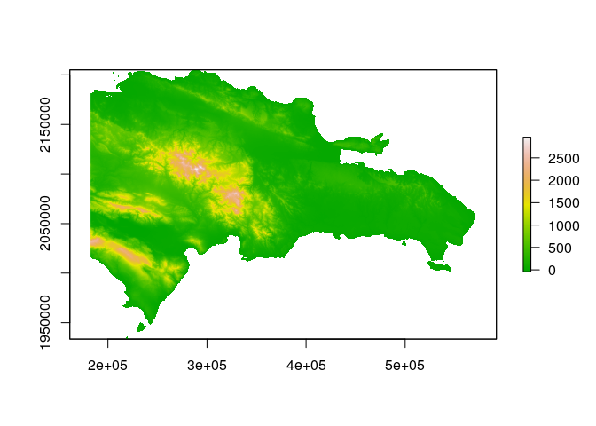

Unidad 1, asignación 2: exportar datos, leer ráster y extraer valores
=====================================================================

Sigo ayudando con `...`. Donde quiera que los veas, deberás sustituirlos por lo que indique el correspondiente mandato.

Dentro de las opciones de `knitr`, en el encabezado de este archivo, es probable que encuentres el argumento `eval = F`. Antes de tejer debes cambiarlo a `eval = T`, para que evalúe los bloques de código según tus cambios.

Provincia asignada
------------------

Toma nota del código de tu provincia asignada aleatoriamente.

``` r
 # abreviatura provaleatoria
 #       acade            11
 #       agrie            09
 #       aleir            10
 #       arqco            16
 #       cindy            12
 #       franc            23
 #       geora            08
 #       hoyod            22
 #       ingan            07
 #       ingdi            19
 #       itac9            15
 #       ivanv            25
 #       lbine            30
 #       leona            24
 #       magda            20
 #       maryj            02
 #       masue            26
 #       mmvol            13
 #       naui2            29
 #       rober            27
 #       wilne            06
 #       yoenn            21
```

Paquetes
--------

-   Carga el paquete `sf` y el paquete `raster`.

``` r
library(sf)
## Linking to GEOS 3.7.1, GDAL 2.4.2, PROJ 5.2.0
library(raster)
## Loading required package: sp
```

Exporta
-------

-   Determina el nombre de la capa provincias con `st_layers` del archivo GeoPackage que se encuentra en la carpeta `data`.

-   Carga la capa de provincias con la función `st_read`, asignándola al objeto `prov`.

-   Genera el objeto `miprov` que sólo contenga tu provincia.

-   Usando la función `st_write`, exporta el objeto `miprov` como GeoPackage a la carpeta `data` con el nombre `miprovexportado.gpkg`.

-   Lee el archivo exportado con la función `st_read` y asígnalo al objeto `miprovexportado`. Dado que sólo tiene una capa, no tienes que especificar el argumento `layer`.

-   Imprime en pantalla el objeto `miprovexportado` (sólo necesitas escribir el nombre del objeto).

``` r
st_layers('data/divisionRD.gpkg')
## Driver: GPKG 
## Available layers:
##      layer_name geometry_type features fields
## 1 PROVCenso2010       Polygon       32      4
## 2  MUNCenso2010       Polygon      155      5
## 3  REGCenso2010       Polygon       10      2
prov <- st_read(dsn = 'data/divisionRD.gpkg', layer = 'ProvCenso2010')
## Reading layer `ProvCenso2010' from data source `/home/naui2/unidad-1-asignacion-2-rasters-y-exportar-datos-espaciales-naui2003/data/divisionRD.gpkg' using driver `GPKG'
## Simple feature collection with 32 features and 4 fields
## geometry type:  MULTIPOLYGON
## dimension:      XY
## bbox:           xmin: 182215.8 ymin: 1933532 xmax: 571365.3 ymax: 2205216
## epsg (SRID):    32619
## proj4string:    +proj=utm +zone=19 +datum=WGS84 +units=m +no_defs
miprov <- prov[prov$PROV %in% '29',]
st_write(obj = miprov, dsn = 'data/miprovexportado.gpkg', driver = 'GPKG')
## Updating layer `miprovexportado' to data source `data/miprovexportado.gpkg' using driver `GPKG'
## Updating existing layer miprovexportado
## Writing 1 features with 4 fields and geometry type Multi Polygon.
miprovexportado <- st_read(dsn = 'data/miprovexportado.gpkg')
## Reading layer `miprovexportado' from data source `/home/naui2/unidad-1-asignacion-2-rasters-y-exportar-datos-espaciales-naui2003/data/miprovexportado.gpkg' using driver `GPKG'
## Simple feature collection with 5 features and 4 fields
## geometry type:  MULTIPOLYGON
## dimension:      XY
## bbox:           xmin: 368414.8 ymin: 2053931 xmax: 461579.8 ymax: 2112223
## epsg (SRID):    32619
## proj4string:    +proj=utm +zone=19 +datum=WGS84 +units=m +no_defs
miprovexportado
## Simple feature collection with 5 features and 4 fields
## geometry type:  MULTIPOLYGON
## dimension:      XY
## bbox:           xmin: 368414.8 ymin: 2053931 xmax: 461579.8 ymax: 2112223
## epsg (SRID):    32619
## proj4string:    +proj=utm +zone=19 +datum=WGS84 +units=m +no_defs
##   PROV REG   TOPONIMIA ENLACE                           geom
## 1   29  09 MONTE PLATA   0929 MULTIPOLYGON (((422830.4 21...
## 2   29  09 MONTE PLATA   0929 MULTIPOLYGON (((422830.4 21...
## 3   29  09 MONTE PLATA   0929 MULTIPOLYGON (((422830.4 21...
## 4   29  09 MONTE PLATA   0929 MULTIPOLYGON (((422830.4 21...
## 5   29  09 MONTE PLATA   0929 MULTIPOLYGON (((422830.4 21...
```

Ráster
------

-   Con la función `raster`, carga el modelo digital de elevaciones que se encuentra en la carpeta `data`. Es el único archivo de extensión `.tif` Asígnalo al objeto `mde`

-   Genera un mapa con la función `plot`, usando la paleta de colores `terrain.colors`.

``` r
mde <- raster('data/mde_rd.tif')
plot(mde, col = terrain.colors(n = 255))
```



Extraer valores del ráster
--------------------------

-   Con la función `raster::extract`, extrae los valores de elevación correspondientes a tu provincia. Utiliza `mde` como objeto ráster y `miprov` como capa zonal. Asigna los valores al objeto `miprovele`.

-   Imprime en pantalla el objeto `miprovele` (sólo necesitas escribir el nombre del objeto).

-   Obtén los estadísticos descriptivos básicos (mínimo, primer cuartil, media, mediana, tercer cuartil, máximo) de `miprovele` con la función `summary`.

-   Genera un histograma de `miprovele` usando la función `hist`.

``` r
miprovele <- raster::extract(mde, miprov)[[1]]
miprovele
##    [1] 132.92 145.19 136.31 109.12 109.67  90.91  75.69 148.16 150.44
##   [10] 147.39 160.81 160.44 167.56 162.81 142.68 129.81 120.97 123.56
##   [19] 168.93 167.13 164.73 159.79 162.07 169.48 176.83 167.61 167.12
##   [28] 168.70 182.17 200.30 172.74 174.82 180.81 168.49 166.45 159.74
##   [37] 158.45 162.50 175.56 175.13 169.05 174.30 171.68 174.14 184.30
##   [46] 182.32 184.08 185.42 197.47 201.13 193.97 179.42 186.84 189.82
##   [55] 185.22 171.10 162.28 172.19 168.64 178.18 183.49 194.62 196.74
##   [64] 187.97 185.17 188.97 190.00 188.96 196.27 196.12 200.19 198.74
##   [73] 185.95 204.55 210.96 202.10 191.84 178.12 165.80 179.88 210.98
##   [82] 209.75 208.30 209.49 206.03 203.83 209.86 208.72 217.67 217.99
##   [91] 217.01 222.90 209.30 204.29 213.91 217.71 208.35 201.02 185.41
##  [100] 186.34  42.19 161.62 183.78 208.18 216.76 219.74 222.44 219.22
##  [109] 220.85 211.98 210.78 219.14 224.63 229.71 231.39 240.95 234.19
##  [118] 236.77 222.52 220.17 223.56 222.33 209.99 194.19  35.20  57.55
##  [127] 175.41 199.61 208.71 210.30 208.97 219.48 240.25 234.06 214.65
##  [136] 220.15 222.79 231.96 238.49 238.90 245.07 249.70 244.81 247.67
##  [145] 238.11 230.99 225.62 228.23 220.78 204.61 206.39  39.90  79.88
##  [154] 158.49 197.63 198.12 202.59 222.61 226.97 238.45 230.21 211.79
##  [163] 225.60 236.26 224.33 236.28 247.12 251.03 258.28 261.90 251.16
##  [172] 246.80 249.07 242.33 236.83 233.01 223.68 217.92 207.15 205.10
##  [181]  37.27  47.23  82.81 135.57 172.52 189.63 205.81 227.56 223.58
##  [190] 216.18 220.14 231.57 230.64 245.51 241.93 251.96 262.96 262.95
##  [199] 268.23 270.72 260.21 253.65 253.59 260.34 253.09 249.42 238.90
##  [208] 237.95 238.08 237.99 240.60  40.93  45.71  61.93 113.05 118.79
##  [217] 168.81 197.86 213.52 208.88 217.05 236.32 239.49 246.73 249.31
##  [226] 252.30 261.77 267.53 270.38 276.07 274.21 275.02 265.69 269.42
##  [235] 264.22 256.63 258.43 259.57 259.33 260.10 266.09 254.54  42.15
##  [244]  58.80  68.72  67.33 136.92 190.27 194.46 198.53 210.21 240.46
##  [253] 229.77 243.85 255.20 259.58 264.95 277.48 278.67 283.26 288.19
##  [262] 281.86 281.68 281.73 271.22 259.92 259.27 270.58 266.77 261.03
##  [271] 266.68 281.41 269.35 259.80 261.40  45.42  48.29  74.75 114.40
##  [280] 116.13 105.01 170.90 195.77 211.74 229.01 228.74 239.14 250.24
##  [289] 250.09 261.00 272.84 279.25 278.96 285.54 285.43 285.64 285.56
##  [298] 287.14 286.89 270.15 258.57 271.23 272.74 276.22 278.36 285.63
##  [307] 285.07 277.12 280.04 289.36  49.68  56.29  96.19 130.98 146.38
##  [316] 136.18 167.01 204.03 217.05 235.42 258.36 264.44 263.32 264.95
##  [325] 274.10 282.61 283.10 282.91 289.40 289.32 295.51 288.62 282.20
##  [334] 280.35 263.46 273.61 281.06 291.77 296.14 296.06 292.46 287.20
##  [343] 291.38 303.08 310.54 305.52  66.80  87.17 129.34 157.86 154.54
##  [352] 186.39 169.16 155.33 227.93 254.94 260.51 247.57 252.44 262.22
##  [361] 272.60 281.25 280.69 281.48 295.71 295.84 301.84 293.16 292.79
##  [370] 289.51 271.72 264.62 277.94 288.82 305.48 312.47 294.50 292.90
##  [379] 296.74 313.01 316.63 312.38 304.11 297.43 292.70 293.60 293.53
##  [388] 288.39  60.93  81.29  84.96 134.66 151.79 174.61 203.38 190.38
##  [397] 212.25 221.49 225.74 229.19 247.62 263.07 270.59 274.89 282.32
##  [406] 286.37 293.05 293.96 297.83 293.82 303.42 291.34 288.62 280.09
##  [415] 287.41 287.93 299.61 312.81 304.10 298.38 297.15 307.39 323.42
##  [424] 321.39 313.25 312.22 305.49 302.75 295.22 293.62 284.46  54.72
##  [433]  62.14  71.16 107.33 167.91 180.16 215.51 219.97 193.00 221.64
##  [442] 259.62 256.63 261.37 257.35 265.90 276.83 287.44 293.45 284.81
##  [451] 284.19 294.06 296.60 301.59 293.62 299.56 292.71 295.44 298.30
##  [460] 300.66 309.12 309.56 301.83 305.59 313.78 323.62 323.97 317.22
##  [469] 323.46 319.59 309.83 303.56 302.96 297.35 297.61  66.92  65.64
##  [478]  74.65 106.89 215.37 200.13 199.76 213.50 231.86 230.13 242.89
##  [487] 257.94 265.72 269.41 269.63 275.14 280.59 288.70 274.10 274.65
##  [496] 288.30 290.72 296.50 289.38 295.89 293.47 296.18 294.30 291.31
##  [505] 309.67 307.05 304.83 312.12 311.18 324.74 329.49 323.56 323.55
##  [514] 328.78 313.83 311.16 311.47 308.18 295.20 295.55  65.97  73.09
##  [523]  88.91  71.28  92.51 191.02 196.94 195.07 208.43 207.93 216.85
##  [532] 228.52 251.33 269.68 276.73 275.20 284.95 287.54 286.68 263.48
##  [541] 260.88 285.09 286.64 294.67 289.32 288.37 289.90 288.67 296.41
##  [550] 289.71 304.05 300.40 303.98 309.46 313.98 324.24 323.53 325.28
##  [559] 325.88 327.57 322.96 315.75 313.72 307.60 306.43 305.52 306.85
##  [568]  69.85  94.48 176.64  99.98  98.11 186.00 190.89 181.74 190.49
##  [577] 214.74 228.55 241.40 246.95 252.41 261.18 275.52 285.30 290.90
##  [586] 290.63 265.69 241.74 263.78 269.67 277.44 282.37 285.85 284.49
##  [595] 275.00 289.24 292.08 294.25 296.81 299.24 300.15 317.02 315.13
##  [604] 315.57 314.06 330.48 329.94 325.76 309.59 312.29 317.40 320.67
##  [613] 318.74 314.23 304.24 300.41 295.94  74.47 141.40 162.91 172.22
##  [622] 158.95 174.74 146.13 179.21 174.17 181.96 209.00 237.90 241.04
##  [631] 227.50 230.83 243.67 259.27 274.42 285.19 258.94 252.46 228.46
##  [640] 261.40 257.84 273.72 273.82 279.21 275.20 275.85 280.15 291.15
##  [649] 289.94 273.12 281.85 289.80 305.48 301.44 311.30 310.43 325.90
##  [658] 322.73 322.42 318.33 326.14 322.54 330.28 299.44 297.06 306.92
##  [667] 298.40 298.68 300.29 297.13  82.72 183.21 287.75 226.21 236.66
##  [676] 252.24 209.24 209.52 205.47 164.54 190.61 197.32 228.04 198.97
##  [685] 186.40 225.11 217.56 298.89 307.09 247.63 219.99 217.12 241.86
##  [694] 253.50 259.25 262.14 262.69 267.55 274.34 277.11 282.01 276.64
##  [703] 248.48 263.71 271.01 296.24 288.79 296.69 303.18 322.51 320.51
##  [712] 319.23 307.65 287.54 293.35 309.50 307.69 293.23 298.98 301.01
##  [721] 304.12 303.34 306.89 302.69  80.75  94.56 120.12 227.28 258.13
##  [730] 242.24 199.08 200.47 230.90 262.67 167.06 186.12 193.68 209.31
##  [739] 168.56 172.96 181.09 197.77 274.68 270.16 248.40 230.69 184.31
##  [748] 200.74 245.19 247.51 249.90 247.85 260.76 274.41 272.36 266.87
##  [757] 248.20 258.65 233.74 232.30 260.75 279.40 290.60 307.24 303.23
##  [766] 299.68 287.73 239.53 260.84 284.87 288.14 304.93 298.06 308.55
##  [775] 308.79 302.05 307.37 306.44 308.89 300.79 264.49 267.92  93.07
##  [784] 107.41 162.07 278.45 261.12 201.50 143.66 132.81 140.52 214.65
##  [793] 150.52 168.69 164.67 161.33 165.43 185.46 198.60 240.70 281.37
##  [802] 239.88 224.62 225.61 189.82 162.77 235.39 235.81 234.16 233.57
##  [811] 251.46 270.87 271.40 247.38 237.83 246.88 214.90 217.94 213.32
##  [820] 244.14 252.24 274.75 260.60 234.68 223.07 223.10 276.10 290.51
##  [829] 298.17 311.44 318.82 316.64 339.44 316.03 330.31 327.52 327.22
##  [838] 312.09 306.35 304.86 291.40 163.88 160.34 227.91  91.67 100.01
##  [847] 118.40 195.08 356.23 278.85 270.10 154.77 152.44 195.80 150.24
##  [856] 132.50 146.72 149.28 161.44 206.31 245.11 229.47 278.52 309.16
##  [865] 276.61 237.46 214.96 169.04 157.24 228.33 225.76 222.23 224.82
##  [874] 235.85 247.49 251.53 231.98 219.59 212.88 213.80 220.42 208.76
##  [883] 207.52 214.64 210.40 213.02 210.33 205.32 261.09 284.59 282.02
##  [892] 291.26 316.65 354.51 369.13 394.68 338.19 343.46 341.45 303.97
##  [901] 303.07 306.75 303.37 302.15 298.11 186.49 133.49 184.94 103.50
##  [910] 100.22 111.29 119.53 130.33 207.12 280.29 211.27 191.58 111.29
##  [919] 122.73 244.36 202.05 202.01 179.70 175.77 194.70 229.44 247.74
##  [928] 250.20 282.78 376.50 303.77 246.20 215.50 164.89 187.30 228.69
##  [937] 216.77 202.96 217.48 221.37 227.91 230.91 225.42 221.23 204.73
##  [946] 206.74 206.31 209.70 204.93 212.98 204.91 204.57 205.39 218.45
##  [955] 255.67 268.42 275.45 288.79 314.94 338.31 343.99 325.01 304.61
##  [964] 303.33 301.03 298.05 301.22 298.85 303.60 307.94 304.46 308.24
##  [973] 301.97 278.32 252.32 243.16 233.40 219.59 183.71 225.18 181.64
##  [982] 119.48 123.48 168.23 150.34 139.38 109.79 116.27 141.84 196.24
##  [991] 170.85 249.52 285.14 221.20 152.45 106.97 102.94 166.01 277.94
## [1000] 297.99 208.21 213.01 264.95 298.29 255.73 268.44 276.66 327.34
## [1009] 335.65 267.81 227.45 181.48 150.50 204.73 201.08 188.30 197.32
## [1018] 201.28 185.77 218.69 219.46 202.71 184.92 188.24 202.94 199.60
## [1027] 210.26 208.28 209.39 206.58 208.07 212.79 240.81 244.40 259.02
## [1036] 277.98 280.40 281.30 281.90 289.47 288.93 282.77 281.03 288.57
## [1045] 287.96 297.90 308.32 308.64 307.52 310.06 313.45 312.98 300.02
## [1054] 305.74 334.47 281.81 249.59 217.34 199.50 192.57 181.45 165.21
## [1063] 135.67 125.38 158.56 148.29 140.55 102.05 112.54 120.64 126.99
## [1072] 103.34 119.06 173.33 225.12 162.42 184.60 237.89 155.03 117.13
## [1081] 113.81  85.14 106.07 195.68 277.81 262.21 252.98 332.89 416.02
## [1090] 391.18 372.05 317.73 285.18 180.21 194.40 214.10 149.75 101.20
## [1099] 140.54 155.40 172.94 164.55 163.47 155.94 195.57 198.81 191.07
## [1108] 176.64 188.33 194.03 196.80 233.55 216.49 194.52 204.21 216.06
## [1117] 228.20 224.70 231.93 241.86 266.61 255.32 247.69 252.19 262.65
## [1126] 267.96 276.25 274.75 280.98 283.73 292.16 307.25 303.46 301.03
## [1135] 310.14 333.93 316.46 295.63 286.89 273.78 278.34 304.84 314.67
## [1144] 385.32 418.27 429.08 395.59 364.52 320.66 359.82 371.12 326.61
## [1153] 302.60 299.24 224.99 251.25 251.18 206.11 134.65 115.30 168.40
## [1162] 138.21 109.07  94.04  81.82  95.00  96.64 114.45 174.58 213.89
## [1171] 163.89 162.30 132.07 165.50 134.38 103.40 101.60  82.16  90.36
## [1180] 146.85 230.62 285.84 288.71 306.97 228.54 307.63 405.94 308.95
## [1189] 280.89 189.87 116.56 127.54 107.47  88.17 115.36 108.84 140.63
## [1198] 124.98 125.72 155.64 213.60 185.38 184.79 173.57 167.15 174.07
## [1207] 191.09 249.43 232.41 188.31 192.72 205.89 218.18 233.02 216.83
## [1216] 240.35 246.26 247.29 253.37 260.09 264.88 265.62 265.58 266.98
## [1225] 272.30 277.06 287.83 299.58 295.80 297.02 300.97 388.99 361.83
## [1234] 288.34 266.57 259.40 261.16 271.59 251.13 275.63 262.82 349.80
## [1243] 345.61 324.20 317.78 251.42 242.62 252.79 315.15 371.65 298.60
## [1252] 318.12 314.40 267.55 271.27 332.87 260.91 152.06 100.60 102.35
## [1261] 107.72 108.47  88.88  76.37  68.78  73.89  94.05 141.56 162.95
## [1270] 121.05 125.01 125.43 128.28 126.27 125.79  88.81  81.45  83.14
## [1279] 175.23 206.28 193.38 210.52 276.97 120.92 140.61 252.99 237.07
## [1288] 213.21 153.69 108.52  88.41  89.45  84.10  94.75  90.66 140.43
## [1297] 125.16 101.92 143.79 170.30 194.47 182.23 174.09 150.38 161.07
## [1306] 189.47 222.37 195.26 176.83 179.82 183.24 200.33 194.78 197.48
## [1315] 222.18 232.08 241.44 242.50 255.12 246.63 246.76 245.47 253.52
## [1324] 267.48 266.60 266.94 271.39 278.11 281.76 281.78 331.35 375.80
## [1333] 357.49 282.50 256.16 263.94 237.31 252.25 228.67 251.82 271.10
## [1342] 279.12 283.14 275.46 200.06 251.91 309.81 347.15 260.81 231.70
## [1351] 216.96 238.97 247.37 244.85 196.55 136.39 112.42  93.58  74.35
## [1360]  74.35  78.50  69.94  84.32  71.04  65.55  90.79 109.60 102.38
## [1369]  91.13 101.32 104.06  94.36  84.76  80.80  86.34  80.21 131.45
## [1378] 173.21 137.03 152.48 235.68 147.77  94.97 155.02 155.82 130.33
## [1387] 124.28 104.21  75.57  90.94  76.51  76.74  90.03 145.82 118.65
## [1396]  89.85 123.24 178.12 225.97 183.52 148.57 135.86 163.51 170.14
## [1405] 180.79 188.78 162.93 162.59 171.72 171.72 185.83 198.24 203.70
## [1414] 218.17 230.78 234.00 234.97 224.01 221.88 226.80 241.32 253.76
## [1423] 250.80 239.96 245.29 261.65 266.54 270.37 255.66 312.66 297.76
## [1432] 278.34 359.73 271.28 221.23 220.81 208.52 204.01 205.53 238.89
## [1441] 237.08 254.05 204.97 281.28 318.83 306.80 328.42 234.55 165.80
## [1450] 168.96 184.43 181.41 204.18 123.78  97.12  94.82  87.01 108.97
## [1459] 106.33 104.88 102.75  90.42  68.46  73.93  93.33  91.27  81.66
## [1468]  93.94  87.90  88.31  75.69  70.99  77.65  73.57  95.86  91.48
## [1477]  91.47 113.55 131.31 111.62  82.05  90.42 100.75  99.36 101.47
## [1486]  93.21  79.57  69.71  74.13  94.72 136.38 118.64  89.53  86.69
## [1495] 102.00 143.81 168.54 176.95 131.27 151.36 151.47 137.69 156.54
## [1504] 187.40 153.53 145.04 151.49 152.97 162.40 195.21 203.05 202.72
## [1513] 213.91 218.00 210.01 205.19 204.18 208.92 218.94 226.13 222.65
## [1522] 223.74 227.78 249.08 253.64 246.39 237.20 262.91 257.66 528.38
## [1531] 349.52 294.78 254.83 233.38 203.83 204.82 201.65 184.15 187.24
## [1540] 196.96 197.03 224.65 253.06 251.54 249.86 214.27 217.34 167.84
## [1549] 145.24 134.70 138.46 143.67 127.07 106.40 104.12 115.40 130.48
## [1558] 152.87 126.76 124.97 100.86  65.37  89.38  94.09  79.46  73.83
## [1567]  82.43  81.63  80.06  73.08  67.32  72.77  76.36  76.08  77.99
## [1576]  81.30  81.45 126.77  88.89  72.15  74.08  86.24  85.81  95.03
## [1585] 100.95  95.71  67.40  98.05 125.73 151.93 110.74  87.88 159.68
## [1594] 120.60 137.40 130.02 147.45 122.90 151.42 131.32 131.44 156.67
## [1603] 190.68 160.70 131.86 141.58 135.12 152.29 197.86 188.69 166.49
## [1612] 177.20 186.94 194.04 194.02 190.65 187.73 192.54 195.88 199.72
## [1621] 205.81 212.18 225.01 242.45 229.99 225.48 434.70 382.48 320.04
## [1630] 269.61 232.15 245.20 222.18 233.27 215.34 191.95 173.14 176.84
## [1639] 190.80 183.54 201.39 265.63 255.64 189.60 156.66 152.25 116.83
## [1648] 117.16 117.80 118.30 105.05 103.82 121.49 138.78 165.77 104.24
## [1657] 196.09 125.30  86.80  60.35  59.71  63.13  82.60  66.35  72.04
## [1666]  68.64  66.85  62.21  69.08  65.97  67.45  65.77  70.45  70.44
## [1675]  80.43  71.60  64.87  67.02  73.99  75.65  76.02  92.25  91.52
## [1684]  63.52  66.28  81.41  87.05  80.06 104.18 135.19 145.05 135.64
## [1693] 104.51 130.57 128.94 135.32 120.39 176.70 224.49 227.52 147.53
## [1702] 115.92 128.84 124.57 129.68 156.23 147.73 150.44 184.00 172.65
## [1711] 180.37 195.61 182.13 171.94 174.33 177.24 171.21 187.78 193.56
## [1720] 222.59 190.11 200.21 353.42 293.73 269.31 234.85 278.53 311.71
## [1729] 261.83 259.77 262.63 288.60 257.85 195.73 163.67 162.80 161.56
## [1738] 169.21 173.85 171.66 217.56 179.44 130.82 193.47 150.60 117.47
## [1747] 128.71 120.85 119.29 137.27 133.91  82.76 101.81 126.01 115.03
## [1756]  54.20  49.08  56.25  68.57  57.29  64.80  61.97  65.21  62.49
## [1765]  70.23  63.71  61.61  60.18  59.66  61.76  58.75  64.22  58.65
## [1774]  60.23  66.61  74.67  66.37  72.24  83.59  69.29  57.04  61.24
## [1783]  73.88  92.72 117.79 117.60  95.22 113.82  95.27 123.44 119.01
## [1792] 106.19 104.90 126.28 158.77 226.67 186.97 106.60 114.11 107.91
## [1801] 124.08 143.37 123.17 136.44 157.02 173.12 203.15 220.20 195.21
## [1810] 170.94 158.89 165.00 182.84 192.40 212.08 227.07 188.35 167.60
## [1819] 456.74 311.29 265.40 243.00 294.24 321.26 330.18 341.27 302.56
## [1828] 270.89 302.03 249.44 178.27 166.68 176.72 156.09 192.89 197.59
## [1837] 162.58 149.12 133.43 191.49 243.17 156.85 143.66 140.77 137.42
## [1846] 189.51 159.37 103.66  63.86  72.56 100.41  65.56  48.07  52.60
## [1855]  53.75  54.77  67.20  59.91  60.06  59.78  67.45  62.36  62.29
## [1864]  62.17  55.05  52.88  53.10  56.93  58.12  56.60  61.09  66.76
## [1873]  59.11  55.16  63.15  61.38  54.74  55.77  65.05  83.93 137.04
## [1882] 137.21  95.46  72.84  79.25  89.24 100.00  89.85  97.45  91.36
## [1891] 118.32 123.04 114.61 101.78  99.93 101.55 126.19 139.38 114.50
## [1900] 137.87 176.30 215.58 230.16 235.87 204.81 170.05 142.67 169.68
## [1909] 205.87 231.77 233.18 157.95 572.37 407.32 294.98 255.00 271.03
## [1918] 274.86 272.45 261.98 234.66 248.33 220.65 205.64 208.34 203.64
## [1927] 208.07 216.80 275.87 345.99 185.48 182.60 242.07 237.60 245.47
## [1936] 228.16 199.86 141.32 110.14 150.35 152.13  93.98  65.23  54.64
## [1945]  59.88  54.08  42.64  47.53  50.15  49.96  56.19  59.22  53.95
## [1954]  55.21  61.51  56.08  63.22  60.80  56.51  52.43  48.85  50.91
## [1963]  53.47  51.41  55.55  57.17  51.79  47.53  52.08  57.64  48.39
## [1972]  52.90  54.02  61.19  91.99 104.69  86.05  69.36  71.54  73.60
## [1981]  84.08  76.35  77.51  81.53  91.15 116.45  96.11  85.57  88.86
## [1990]  94.91  99.97 106.37 110.55 103.57 135.93 163.32 258.67 213.96
## [1999] 175.00 155.56 127.87 155.92 192.01 509.75 366.26 292.03 282.52
## [2008] 266.86 239.76 220.47 266.27 275.12 237.70 330.46 310.80 236.63
## [2017] 206.63 165.24 167.85 197.35 210.95 260.34 310.57 241.41 184.18
## [2026] 197.81 199.25 100.82  77.86  74.49  81.55 140.15  86.41  61.29
## [2035]  50.09  43.73  35.51  41.40  48.07  46.36  49.18  58.55  52.44
## [2044]  51.50  57.55  53.05  56.62  59.05  55.83  52.83  48.79  46.29
## [2053]  50.67  53.17  53.47  53.23  47.47  41.92  47.37  48.33  44.83
## [2062]  49.56  49.36  58.34  73.93  81.29  74.19  69.50  65.44  81.54
## [2071]  83.46  83.85  69.74  72.17  77.74 106.15 100.97  90.74  81.21
## [2080]  91.58 100.99  91.73  98.62  95.59 101.52 122.93 148.51 118.75
## [2089] 112.17 110.47 105.32 123.80 515.87 368.46 377.28 264.90 245.90
## [2098] 234.82 256.13 360.72 366.88 361.04 288.57 223.71 204.83 169.61
## [2107] 161.82 140.26 153.44 250.90 235.45 243.20 147.28 101.81 105.94
## [2116] 100.70  69.08  61.31  56.42 136.02 132.67  64.78  64.16  41.13
## [2125]  36.09  34.59  41.03  43.66  57.39  74.98  55.78  47.89  48.94
## [2134]  46.65  51.67  57.62  54.54  52.73  48.43  41.79  45.00  50.65
## [2143]  44.57  49.87  49.44  36.31  39.68  45.65  42.39  45.94  50.00
## [2152]  58.63  69.08  79.94  75.79  65.69  61.85  74.34  71.13  73.30
## [2161]  68.43  67.55  74.81  73.78  79.50  90.23  76.32 100.38 120.69
## [2170]  88.42  90.35  89.37  86.56 107.54 130.58  92.58  95.57  94.62
## [2179]  98.83 106.68 454.86 524.06 382.19 289.87 254.17 255.44 289.40
## [2188] 443.45 454.79 411.54 387.77 353.48 276.66 226.34 175.58 130.57
## [2197] 110.87 101.64 111.96  92.73  96.92  96.63  83.84  73.25  63.32
## [2206]  54.46  49.54  50.76  60.67  50.57  41.19  38.44  32.89  37.45
## [2215]  49.39  66.52  72.43  65.67  60.76  56.02  45.98  50.55  55.53
## [2224]  53.51  48.82  46.38  39.76  39.22  46.96  40.23  44.64  42.29
## [2233]  37.04  41.66  41.05  43.40  52.83  58.93  59.79  63.48  72.49
## [2242]  75.51  67.53  61.65  72.78  65.42  64.82  59.70  62.20  67.07
## [2251]  67.78  68.37  69.62  73.11  73.09 107.38  87.90  80.80  83.00
## [2260]  78.17  82.66 110.13  86.70  82.44  87.88  98.46 564.69 603.11
## [2269] 545.18 434.57 350.86 294.19 289.73 417.03 435.70 465.29 324.07
## [2278] 220.36 308.07 301.06 255.09 211.65 143.33 116.50 138.58 115.23
## [2287]  79.67  76.07  80.95  77.90  71.59  61.57  45.69  45.23  40.40
## [2296]  38.77  34.11  31.40  33.30  33.93  48.76  56.42  52.26  58.05
## [2305]  62.44  54.06  53.19  42.54  51.45  53.31  50.11  44.80  39.37
## [2314]  39.81  41.18  34.43  36.43  35.48  36.26  46.86  50.86  56.18
## [2323]  67.77  69.04  58.88  63.71  59.56  62.99  62.42  59.28  64.04
## [2332]  58.81  55.88  57.22  63.37  59.18  60.40  58.31  62.40  65.38
## [2341]  67.63  72.92  71.55  73.60  77.66  78.36  75.27  86.52  84.53
## [2350]  81.60  90.99  92.57 685.55 552.16 390.60 321.94 323.60 325.75
## [2359] 310.01 220.97 183.20 202.71 249.92 180.87 166.17 206.51 226.41
## [2368] 187.38 135.83 131.01  93.17  67.02  64.79  63.52  72.69  62.75
## [2377]  66.71  63.37  50.68  42.49  35.38  30.39  33.96  41.87  44.26
## [2386]  43.79  44.95  51.62  41.69  42.68  46.12  52.77  48.31  50.35
## [2395]  44.64  40.86  37.55  34.99  31.94  32.27  34.26  45.86  52.20
## [2404]  60.72  71.12  71.57  63.86  59.89  67.66  54.42  53.11  51.48
## [2413]  53.34  56.62  52.86  54.49  55.07  63.22  55.50  52.65  52.28
## [2422]  60.26  57.72  66.78  62.20  67.04  68.90  72.54  71.52  69.12
## [2431]  76.50  75.65  85.11  87.11 714.16 590.20 469.27 328.83 272.14
## [2440] 239.84 275.24 289.40 199.06 162.96 149.14 135.93 144.39 217.15
## [2449] 198.03 145.80 114.52 119.70 114.68 100.08  90.20 107.44 121.23
## [2458]  96.34  68.90  54.54  48.14  44.44  33.57  30.51  44.03  45.41
## [2467]  41.98  42.94  41.20  38.93  49.00  49.95  54.21  42.68  44.11
## [2476]  44.74  41.55  39.87  36.41  30.73  31.54  44.21  51.82  54.30
## [2485]  55.97  68.26  62.18  54.76  63.07  63.75  54.09  47.77  45.87
## [2494]  49.98  51.09  48.67  49.68  48.82  56.53  57.19  48.26  50.43
## [2503]  52.07  55.66  57.48  58.17  62.16  69.69  67.27  64.38  63.26
## [2512]  67.14  76.02  84.32 773.06 707.45 496.14 393.56 279.19 378.35
## [2521] 500.28 366.29 216.82 185.57 182.96 144.60 164.76 274.40 206.66
## [2530] 142.89 106.97 101.28  87.61  86.22  96.55  69.22  87.61 102.76
## [2539]  78.70  51.19  40.12  35.06  29.12  36.72  55.81  44.62  36.75
## [2548]  31.33  34.55  46.09  41.49  47.21  42.31  35.15  34.86  41.32
## [2557]  37.46  39.59  31.96  29.46  40.76  51.43  56.84  52.77  55.28
## [2566]  54.09  48.29  53.10  55.95  47.89  43.93  48.77  48.70  46.72
## [2575]  46.97  46.30  44.62  49.96  56.94  48.99  47.64  49.36  50.88
## [2584]  51.21  55.76  64.43  71.00  64.44  58.60  60.27  67.97  75.12
## [2593] 812.28 708.23 433.47 260.95 251.25 362.42 318.69 272.47 175.95
## [2602] 155.95 186.70 146.23 236.40 291.46 216.72 193.94 121.84  94.42
## [2611]  80.24  83.57  61.70  61.68  94.61 106.32  56.18  38.90  32.45
## [2620]  30.44  26.48  52.63  53.18  31.05  28.58  32.71  36.97  30.28
## [2629]  35.82  43.74  38.90  28.89  35.54  39.88  35.98  33.77  32.69
## [2638]  39.70  50.06  54.09  56.69  43.53  47.55  46.21  47.86  45.59
## [2647]  39.86  45.42  54.90  48.93  43.09  44.68  44.76  41.27  44.05
## [2656]  50.74  47.59  44.11  44.49  45.30  51.92  57.72  64.26  65.53
## [2665]  57.22  55.46  62.84  71.40 816.99 651.90 425.60 385.36 240.24
## [2674] 184.14 189.71 169.49 280.42 185.39 152.51 135.96 123.17 168.66
## [2683] 286.28 386.30 264.71 133.60  84.77  65.42  60.25  53.88  80.40
## [2692]  66.49  55.80  44.21  32.90  27.08  25.95  31.31  58.56  31.28
## [2701]  25.21  25.23  25.31  20.64  28.53  37.87  33.56  27.02  28.15
## [2710]  37.15  33.40  31.14  28.22  38.14  52.39  49.96  55.85  45.84
## [2719]  36.90  42.19  41.46  38.17  40.54  50.06  55.42  49.66  42.78
## [2728]  43.50  43.66  39.43  41.21  47.53  45.09  41.68  42.93  47.20
## [2737]  52.73  61.58  60.27  61.68  53.52  57.93  65.34  70.48 446.48
## [2746] 235.61 160.01 146.44 150.43 139.15 117.57 140.59 103.24 105.59
## [2755] 145.18 204.14 245.66 126.33 100.00  75.63  59.00  44.07  41.53
## [2764]  48.93  44.85  45.77  40.77  27.29  24.14  29.17  33.87  28.25
## [2773]  22.41  19.02  18.26  15.46  19.41  26.75  24.72  21.97  23.16
## [2782]  30.48  29.71  27.23  27.82  38.23  46.67  48.23  54.81  41.55
## [2791]  33.64  35.74  38.45  36.35  39.44  43.92  49.80  45.72  40.89
## [2800]  46.20  44.81  40.04  36.10  41.99  44.49  39.12  44.31  45.25
## [2809]  54.36  58.55  54.60  55.16  50.71  60.15  67.56  68.05 367.79
## [2818] 197.77 155.75 143.79 139.85 118.28 115.83 125.89 105.44  98.25
## [2827] 142.45 175.36 163.52 137.79 109.34  75.50  66.30  51.98  39.33
## [2836]  28.85  32.68  35.31  29.08  24.57  25.08  30.50  26.77  18.98
## [2845]  18.37  17.11  15.27  15.41  17.93  16.96  17.37  23.45  25.93
## [2854]  25.24  27.17  33.81  40.97  39.11  49.19  53.21  45.01  34.38
## [2863]  33.39  33.83  38.11  44.24  42.04  43.90  42.59  38.91  44.94
## [2872]  44.20  38.44  34.57  40.40  40.78  37.70  40.56  44.63  50.59
## [2881]  48.35  49.13  49.08  51.37  62.46  67.66 468.94 290.91 228.19
## [2890] 186.07 147.36 124.58 128.92 145.34 114.34  91.31  98.37 120.86
## [2899] 138.03 169.54 152.99  98.84  79.96  66.94  52.84  34.15  28.29
## [2908]  26.21  24.99  24.50  22.82  20.02  18.79  17.53  16.07  15.17
## [2917]  12.36  12.60  16.14  22.08  24.21  22.59  24.14  32.82  38.60
## [2926]  36.42  41.52  43.11  39.46  31.98  31.51  37.24  41.35  40.90
## [2935]  38.34  38.38  37.98  34.68  38.28  38.77  35.60  34.02  41.69
## [2944]  37.86  37.52  38.90  45.27  45.46  43.89  47.31  49.88  59.36
## [2953]  65.06  65.19 388.91 403.93 396.82 263.86 177.64 134.52 113.63
## [2962] 107.03 105.59  85.69 130.57 204.79 154.49 106.97  85.37  80.97
## [2971]  96.82 113.63  63.85  43.46  22.84  20.28  13.02  12.04  18.43
## [2980]  22.71  22.51  19.18  19.40  26.80  37.29  30.41  36.65  36.39
## [2989]  37.14  27.89  31.86  36.91  34.11  36.59  33.45  33.36  33.88
## [2998]  33.91  36.38  34.81  30.22  34.85  38.55  33.19  33.28  41.69
## [3007]  43.55  42.64  44.60  51.41  58.03  63.92  64.25  61.61 554.03
## [3016] 412.99 388.26 197.93 142.00 105.16  96.92  93.46  87.38 186.14
## [3025] 213.71 175.12 103.01  63.58  68.83  72.06  53.65  14.18  11.91
## [3034]  18.02  18.44  20.14  17.85  20.84  31.71  33.37  28.34  34.42
## [3043]  31.18  35.53  24.92  26.82  30.29  34.51  31.90  29.13  29.63
## [3052]  30.80  33.51  30.76  30.36  28.63  32.47  32.03  31.33  35.30
## [3061]  36.70  38.02  41.58  48.25  56.81  58.68  59.78  60.87  56.91
## [3070] 509.49 185.93 163.37 132.62  87.63  78.14  90.06 106.06 121.12
## [3079] 133.71  76.37  55.74  53.45  15.08  12.45  13.84  14.83  16.46
## [3088]  16.12  26.20  30.71  32.88  28.45  25.98  27.18  31.11  24.05
## [3097]  23.95  27.91  29.42  25.86  27.75  26.64  28.41  31.27  27.17
## [3106]  27.14  27.56  29.97  32.60  35.83  39.06  38.09  39.05  46.85
## [3115]  53.44  54.51  54.61  55.48  53.81 227.62 118.93  87.29  74.93
## [3124]  75.33  72.43  72.49  73.88  13.53  13.85  15.47  14.53  22.02
## [3133]  27.12  26.97  30.07  27.05  24.62  25.17  30.75  27.49  22.35
## [3142]  25.31  22.02  22.16  25.71  24.72  27.86  26.43  24.01  26.56
## [3151]  28.10  30.73  33.90  35.84  36.89  41.08  43.03  48.45  50.16
## [3160]  50.11  49.53  50.47 288.01 155.26 112.45  92.84  13.61  13.65
## [3169]  11.63  17.37  22.04  26.33  27.27  22.60  22.81  22.70  29.09
## [3178]  29.29  23.70  20.54  19.46  22.67  23.48  24.48  26.36  21.47
## [3187]  25.76  26.69  29.57  30.74  46.82  47.41  47.01  47.37  46.14
## [3196]  45.76  13.19  11.87  12.60  19.48  17.98  22.55  24.62  19.21
## [3205]  19.93  25.06  25.02  23.47  20.65  20.25  17.22  18.67  20.65
## [3214]  22.35  22.04  21.88  23.88  26.58  44.50  43.19  42.89  41.93
## [3223]  14.72  16.80  15.18  17.58  22.24  16.24  17.46  22.72  19.53
## [3232]  17.23  17.08  18.36  15.02  18.44  21.87  21.63  20.71  21.38
## [3241]  23.01  37.57  14.13  12.94  12.45  16.84  16.04  11.38  16.67
## [3250]  19.30  16.89  15.97  14.66  14.40  14.69  16.28  18.83  18.87
## [3259]  18.90  13.45  10.93   9.92  15.13  12.29  11.15  13.66  14.97
## [3268]  15.24  14.38  14.49  13.09  11.76  10.58  12.72  12.41   9.58
## [3277]  14.41  14.84  15.15  12.87   9.59  10.14  10.93  13.93  12.17
## [3286]  11.78  12.07  11.16  10.77   9.80   9.55  12.41  10.67   9.69
## [3295]   8.72   8.29   7.62   6.99   6.73   6.50   7.09
summary(miprovele)
##    Min. 1st Qu.  Median    Mean 3rd Qu.    Max. 
##    6.50   58.55  148.57  158.62  246.20  816.99
hist(miprovele)
```


